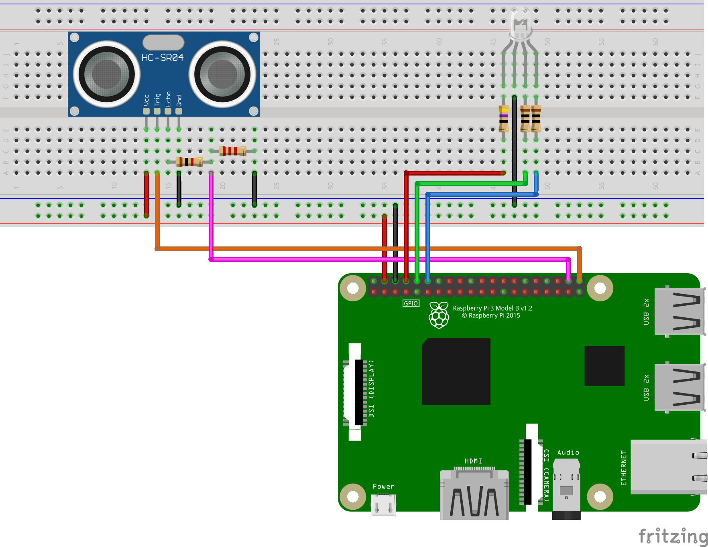
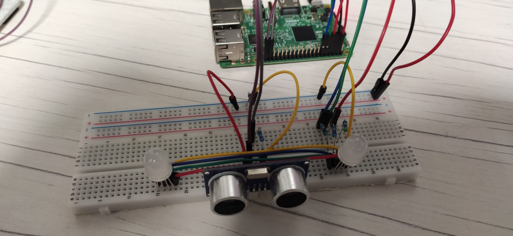

# P5-DistanceUS

This exercise consists on measure distance with the help of the HC-SR04 sensor. You might want to take a look on the wiki, since there is info of everything involved on this project. From the sensor itself to the library used to manage the sensor.

## Circuit Assembly

The assembly is not that messy like the previous one, but in order to preserve the integrity of the Raspberry Pi board we have to make sure that the connections are correct, since there is risk of damaging the GPIO inputs and even the board itself. We are using two RGB Leds, the HC-SR04 sensor and a buch of resistors listed down below:

|Nº|Value|
|---|---|
|2|10 Ω|
|1|47 Ω|
|1|1K Ω|
|1|2.2K Ω|

The largest are used to build a voltage divider which protects the Raspberry Pi GPIO from the 5V output from the HC-SR04.

This is an schematic made with [Fritzing](https://fritzing.org/):

And this is the real circuit!

## Code

## Circuit testing

This is the result! Pretty nice, isn't it?

